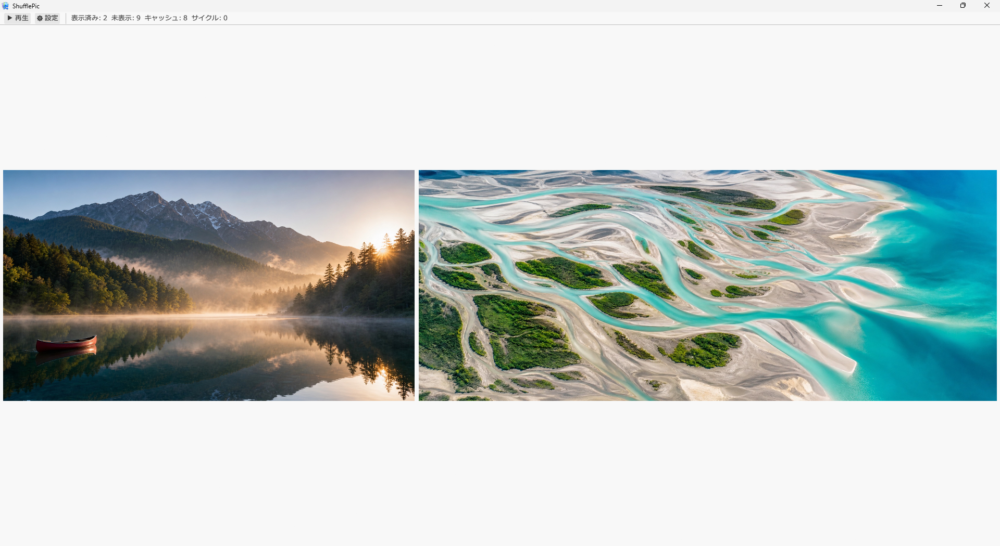
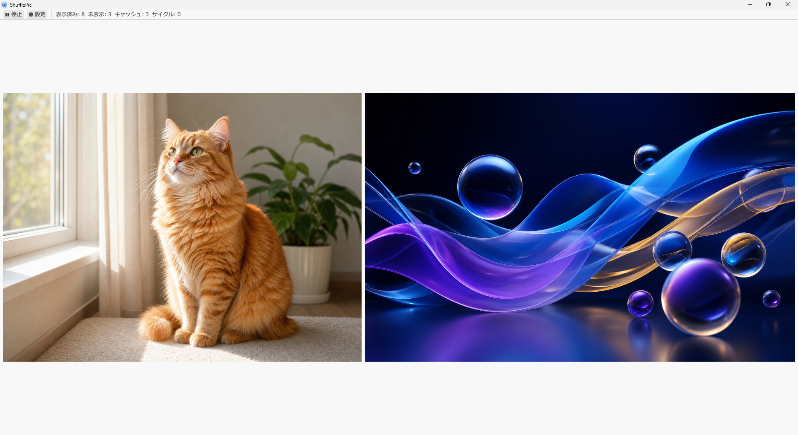

<p align="center">
  
</p>

# ShufflePic

ShufflePic は、指定フォルダ内の画像をランダムかつ重複なしで表示する、Windows向けスライドショーアプリです。

1枚または2枚表示、表示間隔の変更、非同期画像デコード、再生状態の保存に対応しています。

> 公開バージョン: **v1.0**

<p align="center">
  <br>
  
</p>

## Download

- **Microsoft Store**: [ShufflePic を入手](https://apps.microsoft.com/detail/9N336SMBJFSZ)（審査通過後に有効になります）
- ソースからのビルドは [Build from source](#build-from-source) を参照

## Features

- 1サイクル内で重複しないランダム表示
- 1枚／2枚表示の切り替え
- 5〜60秒の表示間隔設定
- 別スレッドでの画像デコードによるUI停止の軽減
- 表示順・進行位置・設定の自動保存
- 同じフォルダで次回起動時に続きから再開
- 実行中に追加・削除された画像への追従
- 右クリックメニューからの再生、一時停止、画像の退避
- 全画面表示
- 巨大画像の自動判定と専用フォルダへの退避

## Supported formats

- JPEG (`.jpg`, `.jpeg`)
- PNG (`.png`)
- GIF (`.gif`)
- BMP (`.bmp`)
- WebP (`.webp`)

GIFは静止画として表示されます。EXIFの回転情報は反映しません。

## Requirements

- Windows 10 version 1607以降、またはWindows 11
- ソースからビルドする場合はRust stable toolchain

## Installation

### Microsoft Store

[Microsoft Store からダウンロード](https://apps.microsoft.com/detail/9N336SMBJFSZ)（審査通過後に有効になります）。

### Build from source

```powershell
git clone https://github.com/ya-ma-n-1972/shufflepic.git
cd shufflepic\v1.0
cargo build --release
.\target\release\shufflepic.exe
```

デコード性能に大きな差があるため、通常利用ではreleaseビルドを使用してください。

## Usage

初回起動時は、上部の「⚙ 設定」から画像フォルダを選択します。

| 操作 | 動作 |
| --- | --- |
| `Space` | 再生／一時停止 |
| `F11` | 全画面表示の切り替え |
| 画像を右クリック | 再生／一時停止、削除、キャンセル |
| 背景をダブルクリック | 全画面表示の切り替え |
| `⚙ 設定` | フォルダ、表示間隔、表示枚数を変更 |

右クリックメニューまたは設定画面を開いている間、自動送りの残り時間は一時停止します。

詳しい操作方法は[操作マニュアル](DOC/ShufflePic%20v1.0%20操作マニュアル.md)を参照してください。

## File handling

ShufflePicは通常、元画像を変更しません。次の操作だけがファイル移動を行います。

### Delete

右クリックメニューの「削除」は、画像を完全削除せず、選択フォルダ内の`delete`サブフォルダへ移動します。

Undo機能はありません。元に戻す場合は、ファイルを手動で移動してください。

### Oversized images

次のいずれかに該当する画像は表示対象外となり、`oversized`サブフォルダへ移動します。

- 総画素数が32,000,000画素を超える
- 長辺が10,000pxを超える

移動先に同名ファイルがある場合は、`name (1).ext`のように番号を付け、既存ファイルを上書きしません。

## Saved state

次の情報は`shufflepic_state.json`へ保存されます。

- 選択した画像フォルダ
- 表示間隔
- 表示枚数
- ランダム表示順
- 現在の進行位置
- サイクル数

保存先は実行ファイルと同じフォルダを優先し、書き込めない場合は`%APPDATA%\ShufflePic`などへフォールバックします。

## Privacy

ShufflePic はデータの収集・保存・送信を一切行いません（完全オフライン）。詳細は[プライバシーポリシー](https://ya-ma-n-1972.github.io/shufflepic/)を参照してください。

## Development

```powershell
cd v1.0
cargo test
cargo clippy --all-targets -- -D warnings
cargo build --release
```

現在の自動検証：

- Unit tests: 13
- `cargo clippy --all-targets -- -D warnings`: pass
- `cargo build --release`: pass

設計資料と実装報告は[ドキュメント索引](DOC/ShufflePic%20ドキュメント索引.md)から参照できます。

## Project structure

```text
shufflepic/
├── DOC/       # 操作マニュアル、要求定義、詳細設計、実装報告、公開計画
├── assets/    # アイコン・スクリーンショット
├── docs/      # プライバシーポリシー（GitHub Pages）
├── v1.0/      # Rustソースコード（src/、packaging/）
└── README.md
```

## Known limitations

- Windows以外のOSは動作対象外です。
- GIFアニメーションには対応していません。
- EXIF回転には対応していません。
- 非同期処理のチューニング値は初期値であり、大量・大判画像での実測調整余地があります。

## Documentation

- [操作マニュアル](DOC/ShufflePic%20v1.0%20操作マニュアル.md)
- [要求定義書](DOC/ShufflePic%20v1.0%20要求定義書.md)
- [詳細設計書](DOC/ShufflePic%20v1.0%20詳細設計書.md)
- [実装報告](DOC/ShufflePic%20v1.0%20実装報告.md)

## License

© 2026 ya-ma-n. All rights reserved.

本リポジトリのソースコードの著作権は作者に帰属します。オープンソースライセンスは付与していません（閲覧は可能ですが、再配布・改変・再利用には作者の許可が必要です）。
